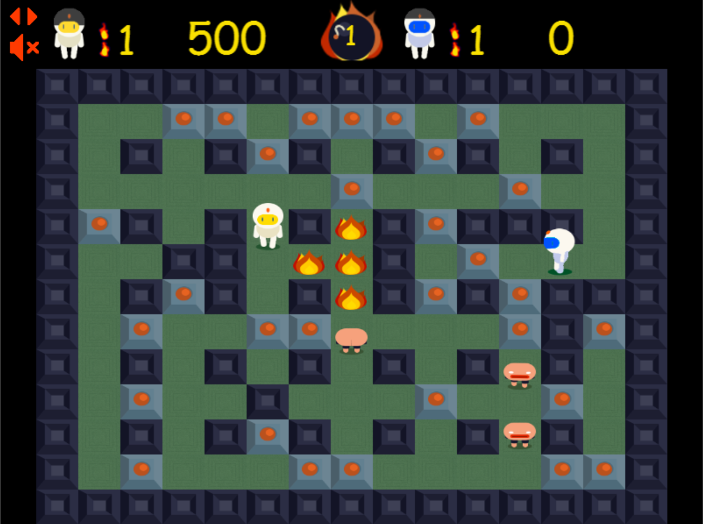
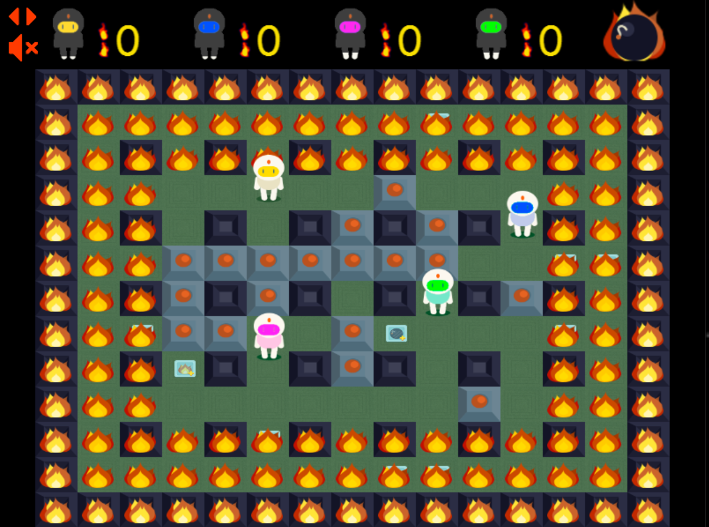

# Super Bomberman (SNES 1993): _remade in javascript (Phaser engine)_
**AKA `Super Bomboozleman`: parody meme name along with comic sans on fire (I know sorry... XD)**

> [Diego Mateos Arlanzón](https://github.com/dimateos) `dimateos@ucm.es` - Design, coding, sprites work, docs, etc

> [Jorge García García](https://github.com/jorgar17) `jorgar@ucm.es` - Design, some little coding and sprites work

> *Team known as GLaDOS for the university class

## Play the game online [here](https://dimateos.github.io/Super_Bomboozleman/).


## Game story

At the start of this semester we came across PVLI (Videogame Programming in Interpreted language) and our teacher Carlos told us: "You need to choose a game, a retro game, and you will remake it in Phaser". So we decided to pick a hard one: Bomberman. We liked the game a lot, and the challenge too.

Our starting plan was to do both, Pve and Pvp modes, from the Super Bomberman (SNES 1993) and we ended up finishing both! (using free sprites to avoid copyright)

The resulting game, Bomboozleman, turned out to be pretty fun too!
* Endless levels alone or with a friend.
* Battles up to 4 players that end up in a sea of flames (if you last too long).

So stop waiting and try it out! And bring some friends to fight over the keyboard ;)

## Gamemodes

### Pve - up to 2 players


Gather points and advance through endless randomly generated levels full of enemies and power ups. Alone or with a friend!

### PvP - up to 4 players


Battle in rounds up to 2 minutes. At the 1.5 minutes mark, rings of flames will start to appear to reduce the arena size.

The last one standing recieves a point and the battle starts again (until a player reaches the amount of points selected to win).

## Controls

* **Movement + bomb**:
  * **Player 1**: `WASD + E`
  * **Player 2**: `ARROWkeys + 1`
  * **Player 3**: `TFGH + Y`
  * **Player 4**: `IJKL + O`

* **Other**:
  * Add extra players: `X`
  * Pause menu: `ESC`
    * Also triggered when the focus is not on the game

* **Hacks**: *(if HACK enabled)*
  * Show debug + be invencible: `C`
  * Rebuild map: `B`
  * Next map: `N`

## Extended GDD  ***(in Spanish)***

If you are interested, it can be found [here](planification/README.md).

* And [here](planification/Diseño.md) is where we analysed the original Super Bomberman mechanics.

* [Here](planification/Planificacion.md), some planification and class structures.

## Resources

* [SuperBomberman (1993), SNES.](https://en.wikipedia.org/wiki/Super_Bomberman)

* [**Phaser**](https://phaser.io/) - A fast, fun and free open source HTML5 game framework

* [Totally Free Bomberman-Inspired Sprites](https://gamedevelopment.tutsplus.com/articles/enjoy-these-totally-free-bomberman-inspired-sprites--gamedev-8541) [by Jacob Zinman-Jeanes.](http://jeanes.co/)

* Initial scaffolding generated with [generator-gamejam](https://github.com/belen-albeza/generator-gamejam/).


## Installation - *in case you fork*

### Requirements

This games uses [gulp](http://gulpjs.com/) for building and tasks automation.

You can install gulp with npm:

```
npm install -g gulp
```

### Build

Clone this repository and install dependencies:

```
git clone dimateos/Super_Bomboozleman
cd Super_Bomboozleman
npm install
```

To **build** the game, run the `dist` task from the project root:

```
gulp dist
```

The `dist` folder will contain a build of the game. You can then start a local server that serves this directory statically to play the game in local:

```
npm install -g http-server
http-server dist
```

You can **clean up** the temporary files and the `dist` folder by running:

```
gulp clean
```

### Development

This project uses [Browserify](http://browserify.org) to handle JavaScript modules.

There is a task that will automatically run Browserify when a JavaScript file changes, and it will also reload the browser.

```
gulp run
```
