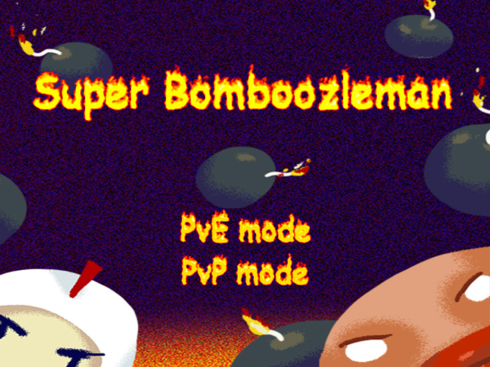

# Super Bomboozleman
*Super Bomberman (SNES 1993) remade in javascript (using Phaser engine)*

>[Jorge García García](https://github.com/jorgar17) `@ucm.es`

>[Diego Mateos Arlanzón](https://github.com/dimateos) `dimateos@ucm.es`

## Play the game online [here](https://dimateos.github.io/PVLI_GLaDOS/).



## Table of contents
- [Gamemodes](#gamemodes)
  - [Pve - up to 2 players](#pve---up-to-2-players)
  - [PvP - up to 4 players](#pvp---up-to-4-players)
- [Controls](#controls)
- [Resources](#resources)
- [Installation - *in case you fork*](#installation---in-case-you-fork)
  - [Requirements](#requirements)
  - [Build](#build)
  - [Development](#development)

## Gamemodes

### Pve - up to 2 players

Gather points and advance through generated levels full of enemies and power ups. Alone or with a friend!

### PvP - up to 4 players

Battle in rounds up to 3 minutes.

* Many power ups generated with the map.

* The last one standing recieves a point and the battle starts again.

* At the 2 minutes mark, ring flames will start to appear to reduce the arena size.

## Controls

* **Movement + bomb**:
  * **Player 1**: `WASD + E`
  * **Player 2**: `ARROWkeys + 1`
  * **Player 3**: `TFGH + Y`
  * **Player 4**: `IJKL + O`

* **Other**:
  * Add second player in PVE: `X`
  * Pause menu: `ESC`
    * Also triggered when the focus is not on the game

* **Hacks**: *(maybe disabled)*
  * Rebuild map: `B`
  * Next map: `N`

## Resources

* [SuperBomberman (1993), SNES.](https://en.wikipedia.org/wiki/Super_Bomberman)

* [**Phaser**](https://phaser.io/) - A fast, fun and free open source HTML5 game framework

* [Totally Free Bomberman-Inspired Sprites](https://gamedevelopment.tutsplus.com/articles/enjoy-these-totally-free-bomberman-inspired-sprites--gamedev-8541) [by Jacob Zinman-Jeanes.](http://jeanes.co/)

* Initial scaffolding generated with [generator-gamejam](https://github.com/belen-albeza/generator-gamejam/).


## Installation - *in case you fork*

### Requirements

This games uses [gulp](http://gulpjs.com/) for building and tasks automation.

You can install gulp with npm:

```
npm install -g gulp
```

### Build

Clone this repository and install dependencies:

```
git clone dimateos/PVLI_GLaDOS
cd PVLI_GLaDOS
npm install
```

To **build** the game, run the `dist` task from the project root:

```
gulp dist
```

The `dist` folder will contain a build of the game. You can then start a local server that serves this directory statically to play the game in local:

```
npm install -g http-server
http-server dist
```

You can **clean up** the temporary files and the `dist` folder by running:

```
gulp clean
```

### Development

This project uses [Browserify](http://browserify.org) to handle JavaScript modules.

There is a task that will automatically run Browserify when a JavaScript file changes, and it will also reload the browser.

```
gulp run
```
