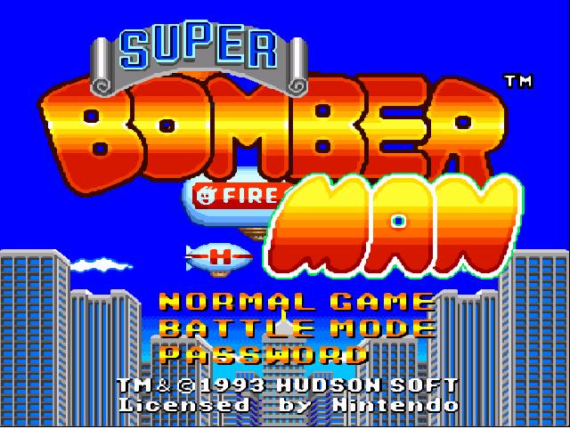
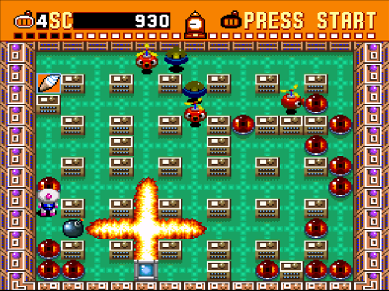
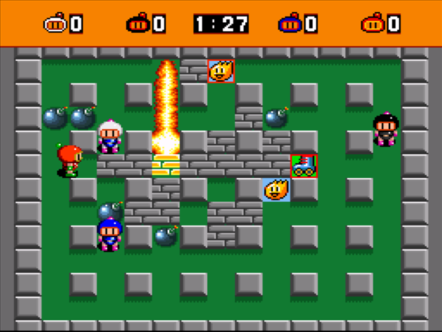

# Super Bomberman JS
*Super Bomberman (SNES 1993) remade in javascript.*

>[Jorge García García](https://github.com/jorgar17) `@ucm.es`

>[Diego Mateos Arlanzón](https://github.com/dimateos) `dimateos@ucm.es`

Initial scaffolding generated with [generator-gamejam](https://github.com/belen-albeza/generator-gamejam/).

- [Super Bomberman JS](#super-bomberman-js)
    - [Installation](#installation)
        - [Requirements](#requirements)
        - [Build](#build)
    - [Development](#development)
    - [Documento de concepto de videojuego](#documento-de-concepto-de-videojuego)
        - [Descripción](#descripci%C3%B3n)
        - [Portada](#portada)
        - [Experiencia deseada](#experiencia-deseada)
        - [Dinámicas de juego](#din%C3%A1micas-de-juego)
        - [Mecanismos e interfaz de juego](#mecanismos-e-interfaz-de-juego)
        - [Otras consideraciones](#otras-consideraciones)
        - [Referencias](#referencias)
        - [Sprites posibles](#sprites-posibles)

## Installation

### Requirements

This games uses [gulp](http://gulpjs.com/) for building and tasks automation.

You can install gulp with npm:

```
npm install -g gulp
```

### Build

Clone this repository and install dependencies:

```
git clone dimateos/PVLI_GLaDOS
cd PVLI_GLaDOS
npm install
```

To **build** the game, run the `dist` task from the project root:

```
gulp dist
```

The `dist` folder will contain a build of the game. You can then start a local server that serves this directory statically to play the game in local:

```
npm install -g http-server
http-server dist
```

You can **clean up** the temporary files and the `dist` folder by running:

```
gulp clean
```

## Development

This project uses [Browserify](http://browserify.org) to handle JavaScript modules.

There is a task that will automatically run Browserify when a JavaScript file changes, and it will also reload the browser.

```
gulp run
```


You can deploy to your own server via **rsync**. This is done with the `deploy:rsync` task, which will build the project and then copy the `dist` folder to the remote server.

```
gulp deploy:rsync
```

In order for this to work, you need to edit or create a `gulp.config.json` file with the following fields:

```
{
  "deploy": {
    "user": "root",
    "host": "somewhere.com",
    "destination": "/path/to/folder/"
  }
}
```

## Documento de concepto de videojuego
| Genero | Modos         | Público          | Plataforma |
| ------ | ------------- | ---------------- | ---------- |
| Arcade | 1-4 jugadores | Todas las edades | PC         |

### Descripción
Remake del **Super Bomberman** de la **SNES**, juego el cual se basa en la destrucción de muros utilizando bombas que el jugador coloca en el
suelo. Mediante el uso de estas bombas también se debe matar enemigos y obtener puntos. Dos modos de juego diferentes:
* **Singleplayer**: El jugador se enfrenta a diferentes niveles con variadas temáticas. Para superarlos tiene que explotar todos los muros y enemigos.
* **Arena**: 1-4 jugadores se enfrentan por ser el último en pie. Posibilidad de jugar con IA (incluso que los 4 sean IA).

### Portada


### Experiencia deseada
Una experiencia clásica, divertida y rápida en la cual el jugador/es tengan una sensación de acción directa. Las partidas son extremadamente ágiles y caóticas, llenas de power up's. La acción y tensión se intensifican a medida que los muros se rompen y se van abriendo caminos que conectan a los participantes (o IA).

### Dinámicas de juego
Existe un numero máximo de bombas disponibles (ampliable por power ups) que indica cuantas bombas se pueden colocar en el suelo sin tener que esperar a que exploten. Los power ups aparecen de manera aleatoria al explotar un obstáculo en ambos modos de juego. Según el modo de juego:
* **Singleplayer:** El jugador deberá explotar todos los muros y explosivos para poder pasar al siguiente nivel usando una escalera. Si se intenta explotar la escalera se genera un enemigo. El jugador cuenta con un determinado numero de vidas y si se le acaban se termina la partida (podrá recuperarlas en forma de power up).
* **Arena:** Los jugadores solo tienen una única vida y gana el último en pie. No hay enemigos ni escalera. Superada cierta marca de tiempo la arena reduce su tamaño para añadir tensión y agilidad al final de la partida.

### Mecanismos e interfaz de juego
Típicos **controles** WASD o flechas de direccion para mover a tu personaje (para multijugador hasta 4 hay que pensarlas) y un boton extra para colocar tu bomba/s. El movimiento es solo horizontal y vertical.

Las **bombas** son objetos fisicos que no se pueden desplazar, como los muros, por lo que se puede encerrar jugadores con ellas. Como ya se ha explicado, existe un numero máximo de bombas disponibles que indica cuantas bombas se pueden colocar en el suelo sin tener que esperar a que exploten (de serie 10). Las bombas tienen un radio de explosión que determina cuanto se expande a las casillas contiguas no diagonales (no simultáneamente). Al principio el radio es 1. La explosión rompe los muros destructibles que estén dentro del radio y detiene su expansión.

Las **vidas** solo se pierden al ser golpeado por la expansión de una explosión o por tocar a un enemigo del modo *Singleplayer*.

En los **menús** se utilizan los controles de movimiento y la tecla `enter` para seleccionar. Al principio del juego se abre un menú simple para escoger que modo de juego u opciones. Si escoges modo *Arena* existe otro menú para determinar el numero de jugadores, etc.



La **interfaz** será como en el juego clásico, diferente segun el modo.




### Otras consideraciones
* **Requisitos artísticos:** Sprites y sonido originales si no tienen copyright.
* **Requisitos tecnológicos:** Javascript, Phaser...
* **Aspectos de producción:**
Realización en pareja, utilización de Github, etc.

### Referencias
* [SuperBomberman (1993), SNES.](https://en.wikipedia.org/wiki/Super_Bomberman)
* [Version jugable emulada online (minijuegos.com).](http://www.minijuegos.com/juego/super-bomberman)
* [Video del *singleplayer* completo (youtube.com)](https://www.youtube.com/watch?v=25C5Ccnmag8)

### Sprites posibles
* [Sprites originales (spriters-resource.com).](https://www.spriters-resource.com/snes/sbomber/)
* [An excellent set of free bomberman sprites](https://gamedevelopment.tutsplus.com/articles/enjoy-these-totally-free-bomberman-inspired-sprites--gamedev-8541) [by Jacob Zinman-Jeanes.](http://jeanes.co/)
* [A much simpler 16bit version of a bomberman game (OpenGameArt.org).](https://opengameart.org/content/bomb-party-the-complete-set)
