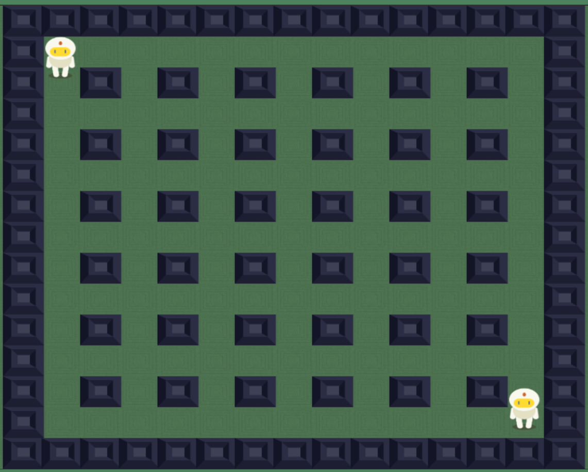
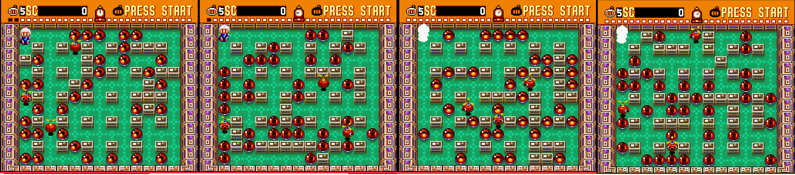
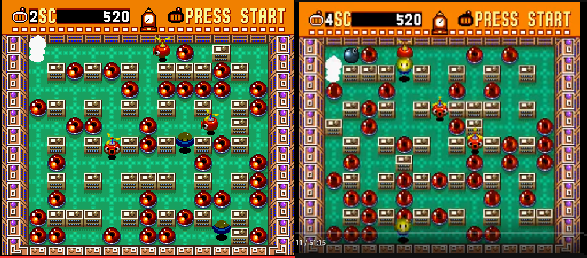
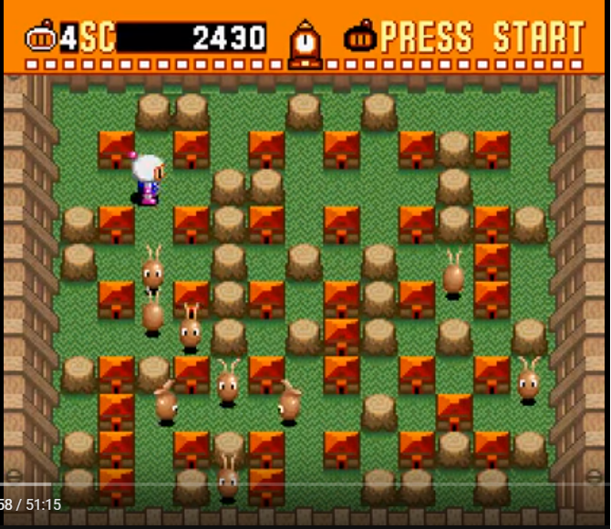
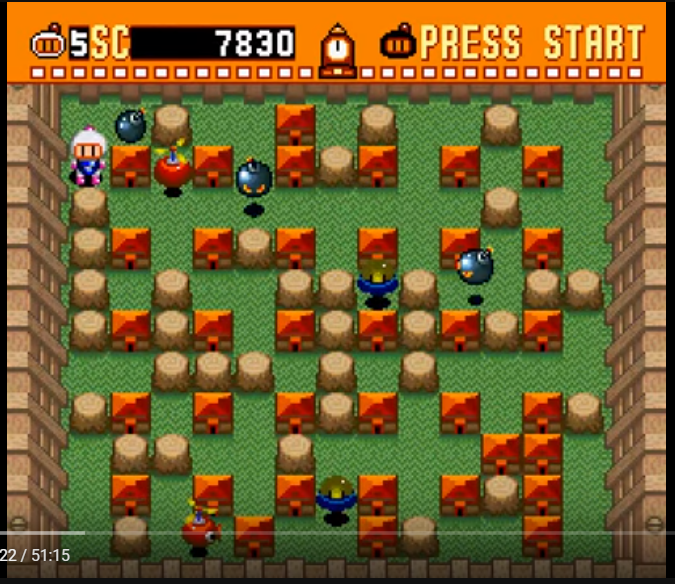
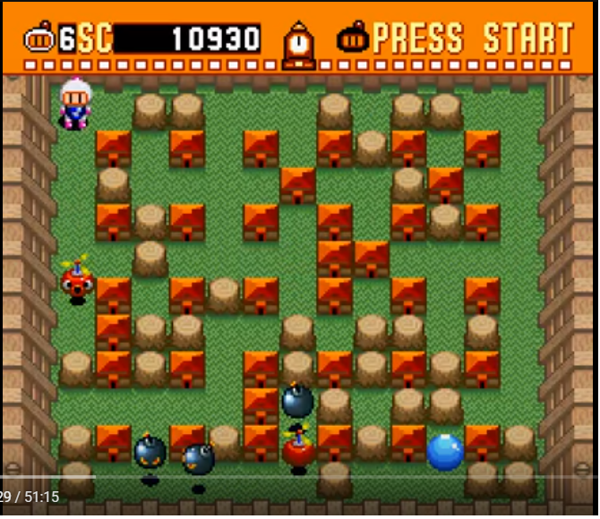
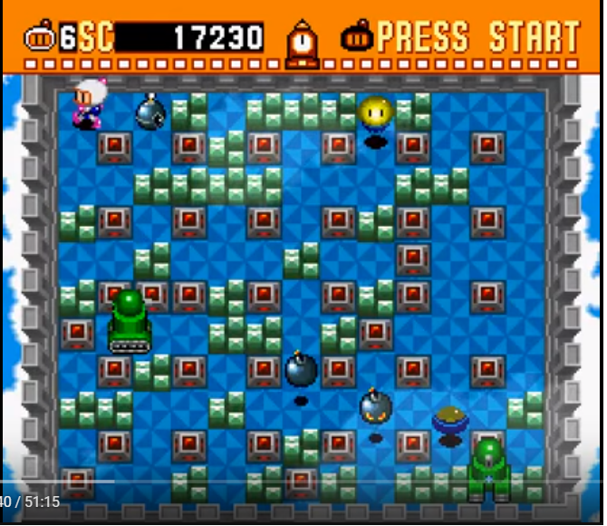
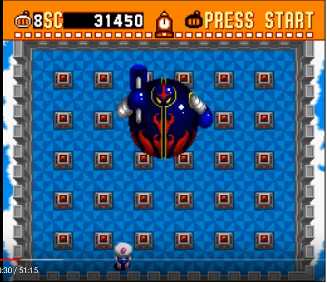

# Cuestiones de diseño

> Analisis de los sistemas del juego

- [Cuestiones de diseño](#cuestiones-de-dise%C3%B1o)
    - [Fuentes](#fuentes)
    - [Vidas](#vidas)
    - [Power Ups](#power-ups)
        - [Implementacion](#implementacion)
        - [[Lista completa](https://strategywiki.org/wiki/Super_Bomberman/Power-ups)](#lista-completahttpsstrategywikiorgwikisuperbombermanpower-ups)
            - [Basicos](#basicos)
            - [Mejorados](#mejorados)
            - [Modo normal only](#modo-normal-only)
            - [Modo normal - extra points only](#modo-normal---extra-points-only)
    - [Bomba](#bomba)
    - [Enemigos](#enemigos)
    - [Generacion de niveles](#generacion-de-niveles)
        - [Mundo 1-1](#mundo-1-1)
        - [Mundo 1-2](#mundo-1-2)
        - [Mundo 1-3](#mundo-1-3)
        - [Mundo 1-4](#mundo-1-4)
        - [Mundo 1-5](#mundo-1-5)
        - [Mundo 1-6](#mundo-1-6)
        - [Mundo 1-8 BOSS](#mundo-1-8-boss)

## Fuentes

* Longplays in YT like [this](https://www.youtube.com/watch?v=uxhzsTI_LwI), or
[this](https://www.youtube.com/watch?v=25C5Ccnmag8).
* Other shorter gameplays, etc
* Online emulated game: [minijuegos.com](http://www.minijuegos.com/juego/super-bomberman)

## Vidas

* Tiempo para pasar el nivel o mueres: Un poco menos de **3 minutos** (probablemente exactos)
    * Si superas el nivel se resetea para el siguiente

* La invulnerabilidad al respawnear/nivel nuevo dura: alrededor de **5 segundos**
    * No se quita aunque te muevas/coloques bombas etc

* Cada **5000 puntos** recupera una vida
    * Morir no quita puntos

## Power Ups

No estoy seguro de si su aparicion esta limitada por niveles ni caja/enemigo.
Los enemigos y cajas por nivel son cte -> sus drops no (ni cantidad ni tipo).

> En el juego original, cuando un enemigo muere y no esta en una casilla exacta
> el drop aparece en la casilla inicial (Ej, muerte por golpe de bomba)

### Implementacion
* Los power up tienen tiers de basico a mejorado (e intermedios?) para el modo normal
    * *Tier 0*: BombaUp, BombaPower, Patines...
    * *Tier 1*: Empujar, BombControl, Escudo, Tiempo...
    * *Tier 2*: Golpear, Atravesar?...
    * *Drops de puntos*: Ajustados a tier segun cantidad.

* Al generar el nivel se asignan todos los drops de forma aleatoria.
    * Siempre la misma cantidad entre los enemigos
        * Cantidad de diferentres tiers constante
        * El drop exacto del tier es random
    * Igual con los muros: el player escoge si perder tiempo o no

* En el original parece haber muy baja aleatoriedad sobre la cantidad
    * Pero es cierto que varia de uno a veces
    * Se puede implementar posteriormente

### [Lista completa](https://strategywiki.org/wiki/Super_Bomberman/Power-ups)
#### Basicos
* **BombaUp**, *10 pts*, **MAX 10**, le da al jugador una bomba extra.
* **BombaPower**, *200 pts*, **MAX 10**, aumenta el radio de explosion de las bombas.
    * **MaxBombaPower**, *? pts*, aumenta el radio de explosion de las bombas al maximo
* **Patines**, *400 pts*, aumenta la velocidad del jugador
    * Baja 1 cada vez que el player muere (min = 1)

#### Mejorados
* **Empujar**, *3000 pts*, permite empujar bombas
    * ***Solo dura ese nivel***
    * No puedes empujar bombas que esten pegadas a un solido
* **BombControl**, *300 pts*, permite explotar la bomba a voluntad
    * De forma ordenada (cola)
    * ***Se pierde al morir?***
* **Golpear?**, *? pts*, permite lanzar bolando la bomba?
* **Skull**, *? pts*, da un efecto negativo.

#### Modo normal only
* **AtravesaCajas**, *800 pts*, poder atravesar destructibles.
* **TiempoExtra**, *900 pts*, reinicia el tiempo totalmente
* **Escudo**, *500 pts*, te pone en modo invulneable hasta recibir un hit?
    * Parece que es por tiempo, da igual los hits
    * ***Solo dura ese nivel***
* **MORE...**

#### Modo normal - extra points only
* **Helado** 300 pts
* **MORE...**

## Bomba

* Spawnea en la posicion del jugador - el jugador puede salir pero no volver a entrar
    * Si un enemigo va a por el pero esta "dentro de la bomba" no puede darle

* Explota en alrededor de **2 segundos** (probablemente exactos)
    * Aparentemente la exlosion no es instantanea
    * Se propaga hasta su radio maximo con cierto delay

* La propagacion se detiene al romper una caja
    * Pero no al matar un enemigo

* Una explosion de bomba detona otra instantaneamente (mantiene el delay)

## Enemigos

Para ver sprite y respectivos niveles mirar generacion de niveles.
Movimiento simple, habria que analizar los diferentes.

* **type-0:** 1 hit, *100 puntos*, 1 speed
* **type-1:** 2 hits, *400 puntos* 1 speed
* **type-2:** 1 hit, *200 puntos*, 1 speed?
* **type-3:** 1 hit, *800 punyos*, 1 speed (cte parece)
    * Se transforma en bomba y explota (radio 3)
    * Puede matar otros enemigos no le da pts a nadie
    * Si matan a otro de su tipo este segundo no llega a explotar
    * Aparentemente no bombean de forma exacta
        * 5 segundos empiezan animacion - 2 explotan - 2 vuelven a moverse
* **type-4:** 1 hit, 400 puntos, 1 speed
    * No le afectan las bombas/explosiones (empujarle una bomba no lo mata)
    * Le atraen las bombas! Se las come/va a por ellas
    * Una vez se ha comido una cualquier explosion le mata
* **type-5:** 4 hit, 1600 points, 1 speed
    * Cada x tiempo disparan un lanzallamas (3 casillas) en dir rnd
    * Rompe la primera caja que encuentra

## Generacion de niveles

* Se superan acabando con todos los enemigos y encontrando la entrada.
* No hace falta romper todas las cajas.
* El theme cambia segun el stage

* Spawn de jugador siempre cte: **arriba a la izquierda**
* El mapa siempre parte de una **plantilla** cte:

* Posteriormente al mapa se le añaden **40-41 bloques** diferentes
    * Posiciones aleatorias pero sin sobreescribir plantilla
    * Su cantidad y tipo varia segun el nivel

* Tambien se le añaden enemigos en pos aleatorias
    * Tmb varia cantidad y tipo con nivel

### Mundo 1-1

* 8 muros extra
* 33 cajas
* 3*type-0

### Mundo 1-2

* 6 muros extra
* 35 cajas
* 3*type-0 + 2*type-1

### Mundo 1-3

* 6 muros extra
* 35 cajas
* 9*type-3

### Mundo 1-4

* 6 muros extra
* 35 cajas
* 2*type-0 + 2*type-1 + 2*type-3

### Mundo 1-5

* 6 muros extra
* 34 cajas? *(menor total de extras)*
* 2*type-0 + 3*type-3 + 1*type-4

### Mundo 1-6

* 6 muros extra
* 34 cajas?
* 2*type-1 + 2*type-3 + 2*type-5

### Mundo 1-8 BOSS

* plantilla base
